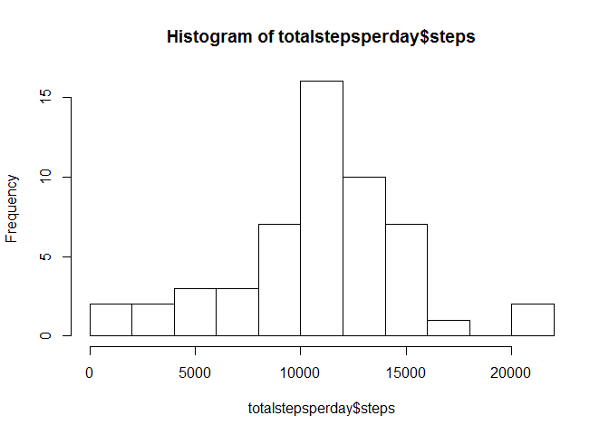
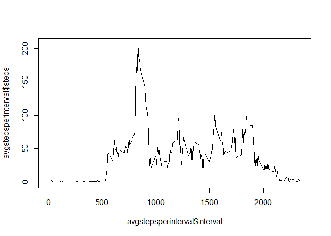
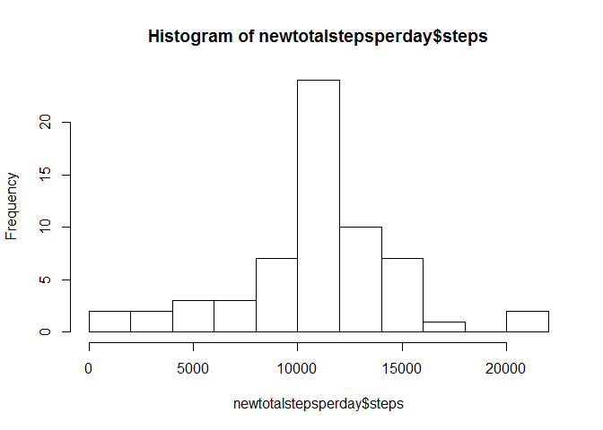
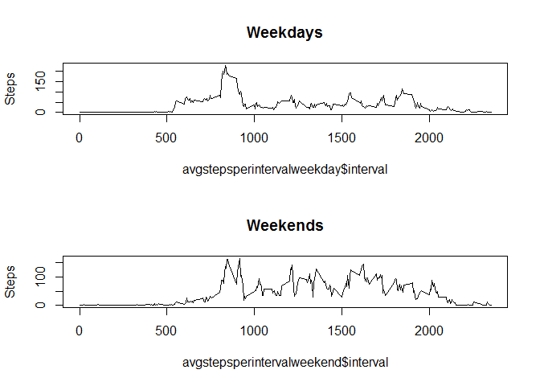

##1 Read in Data and preprocess the data if necessary


```r
# read in data
data <- read.csv("C:/Users/yguo/Documents/R/activity.csv")
dim(data)
```

```
## [1] 17568     3
```

```r
str(data)
```

```
## 'data.frame':	17568 obs. of  3 variables:
##  $ steps   : int  NA NA NA NA NA NA NA NA NA NA ...
##  $ date    : Factor w/ 61 levels "2012-10-01","2012-10-02",..: 1 1 1 1 1 1 1 1 1 1 ...
##  $ interval: int  0 5 10 15 20 25 30 35 40 45 ...
```

```r
summary(data)
```

```
##      steps                date          interval     
##  Min.   :  0.00   2012-10-01:  288   Min.   :   0.0  
##  1st Qu.:  0.00   2012-10-02:  288   1st Qu.: 588.8  
##  Median :  0.00   2012-10-03:  288   Median :1177.5  
##  Mean   : 37.38   2012-10-04:  288   Mean   :1177.5  
##  3rd Qu.: 12.00   2012-10-05:  288   3rd Qu.:1766.2  
##  Max.   :806.00   2012-10-06:  288   Max.   :2355.0  
##  NA's   :2304     (Other)   :15840
```

```r
head(data)
```

```
##   steps       date interval
## 1    NA 2012-10-01        0
## 2    NA 2012-10-01        5
## 3    NA 2012-10-01       10
## 4    NA 2012-10-01       15
## 5    NA 2012-10-01       20
## 6    NA 2012-10-01       25
```

```r
# change date to date format
data$date <- as.Date(data$date, format = "%Y-%m-%d")
```

##2 What is mean total number of steps taken per day?


```r
# total number of steps taken per day
totalstepsperday <- aggregate(steps ~ date, data = data, FUN = sum)
# histogram of total number of steps taken each day and store into plot1
hist(totalstepsperday$steps, breaks = 10)
```

<!-- -->

```r
dev.copy(png, file = "plot1.png", width = 480, height = 480)
```

```
## png 
##   3
```

```r
dev.off()
```

```
## png 
##   2
```

```r
# mean and median of total number of steps taken per day
mean(totalstepsperday$steps)
```

```
## [1] 10766.19
```

```r
median(totalstepsperday$steps)
```

```
## [1] 10765
```

##3 What is the average daily activity pattern?


```r
# time series plot and store into plot2
avgstepsperinterval <- aggregate(steps ~ interval, data = data, FUN = mean)
plot(avgstepsperinterval$interval,avgstepsperinterval$steps, type='l')
```

<!-- -->

```r
dev.copy(png, file = "plot2.png", width = 480, height = 480)
```

```
## png 
##   3
```

```r
dev.off()
```

```
## png 
##   2
```

```r
# which interval has the max average steps
avgstepsperinterval[which.max(avgstepsperinterval$steps),][[1]]
```

```
## [1] 835
```

##4 Imputing missing values

```r
# total number of NAs in the dataset
sum(is.na(data))
```

```
## [1] 2304
```

```r
# fill in missing value using mean of that 5-minute interval and round up to nearest 1 since no partial step can be taken
for (i in 1:nrow(data))
    {if(is.na(data[i,]$steps))
        {data[i,]$steps <- ceiling(avgstepsperinterval[avgstepsperinterval$interval == data[i,]$interval,]$steps)} 
    }
# Below should be TRUE
sum(is.na(data)) == 0
```

```
## [1] TRUE
```

```r
# total number of steps taken per day in new data
newtotalstepsperday <- aggregate(steps ~ date, data = data, FUN = sum)
# histogram of total number of steps taken each day in new data and store into plot3
hist(newtotalstepsperday$steps, breaks = 10)
```

<!-- -->

```r
dev.copy(png, file = "plot3.png", width = 480, height = 480)
```

```
## png 
##   3
```

```r
dev.off()
```

```
## png 
##   2
```

```r
# mean and median of total number of steps taken per day in new data
mean(newtotalstepsperday$steps)
```

```
## [1] 10784.92
```

```r
median(newtotalstepsperday$steps)
```

```
## [1] 10909
```

##5 Differences in activity patterns between weekdays and weekends

```r
# add weekday to the new data set
data$day <- as.POSIXlt(data$date)$wday
for (i in 1:nrow(data)) {if (data[i,]$day %in% c(0,6)){data[i,]$day<-'weekend'} else {data[i,]$day<-'weekday'}}
data$day <- as.factor(data$day)
# time series plot for weekdays and weekends and store into plot4
avgstepsperintervalweekday <- aggregate(steps ~ interval, data = data[which(data$day == 'weekday'),], FUN = mean)
avgstepsperintervalweekend <- aggregate(steps ~ interval, data = data[which(data$day == 'weekend'),], FUN = mean)
par(mfrow=c(2,1))
plot(avgstepsperintervalweekday$interval,avgstepsperintervalweekday$steps, type='l',main = 'Weekdays',ylab='Steps')
plot(avgstepsperintervalweekend$interval,avgstepsperintervalweekend$steps, type='l',main = 'Weekends',ylab='Steps')
```

<!-- -->

```r
dev.copy(png, file = "plot4.png", width = 480, height = 480)
```

```
## png 
##   3
```

```r
dev.off()
```

```
## png 
##   2
```
